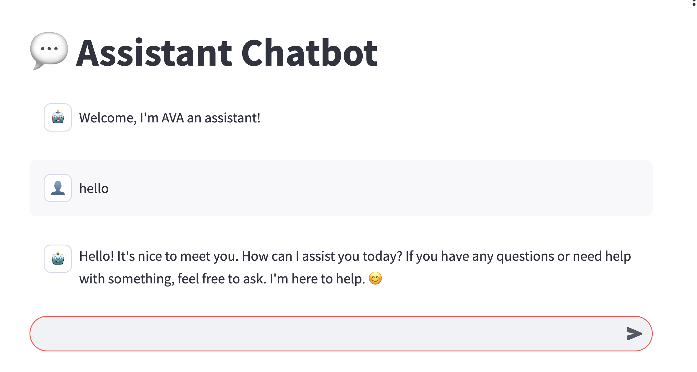

# Cours - Industrialisation des modèles d’IA

*Comment déployer un modèle en production ?*

### Contenu du cours

- Accès aux slides de cours : [Industrialisation des modèles d’IA](https://www.canva.com/design/DAGeRV2CWus/5yr41vng61fwADz9HveWgQ/view?utm_content=DAGeRV2CWus&utm_campaign=designshare&utm_medium=link2&utm_source=uniquelinks&utlId=h4b276b8610)

### TD & TP

- Exercice 1 : Entraînement, exportation d'un CNN et versioning
- Exercice 2 : Comparaison de YOLOv11n et YOLOv11x avec Weights & Biases
- Exercice 3 : Création d'un chatbot

